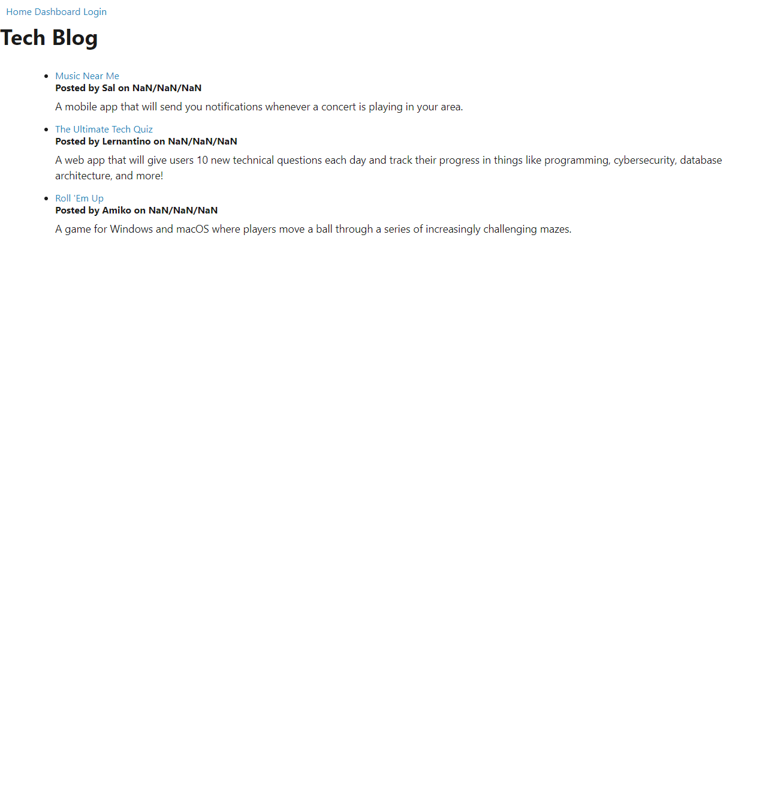
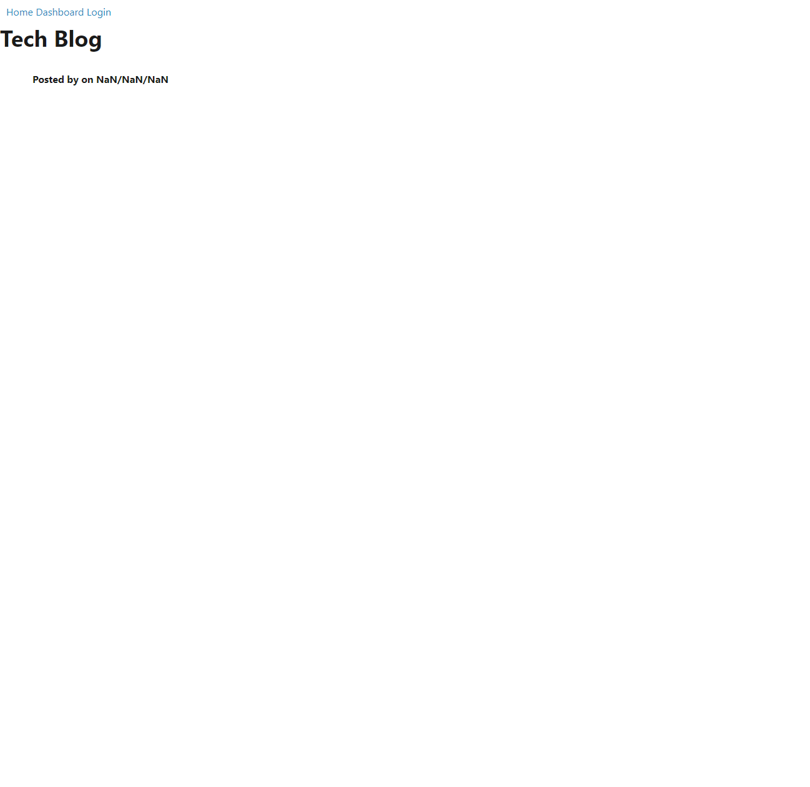
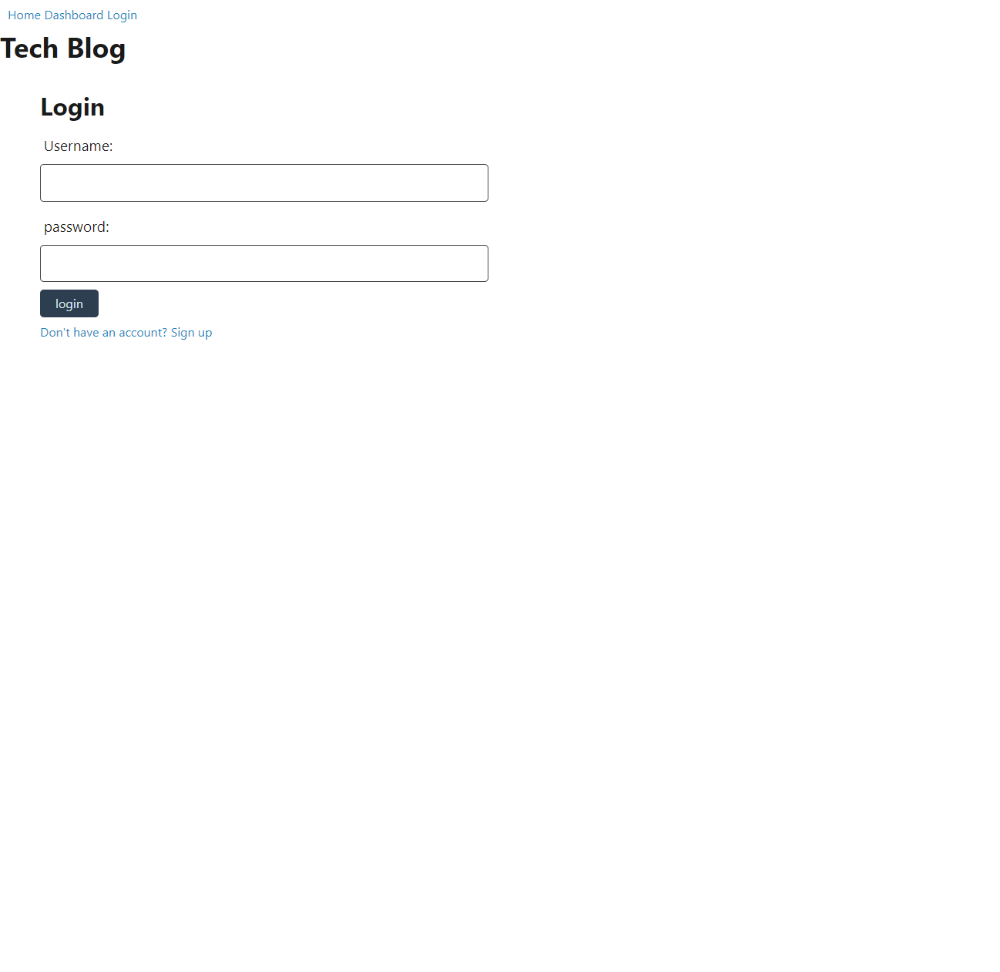
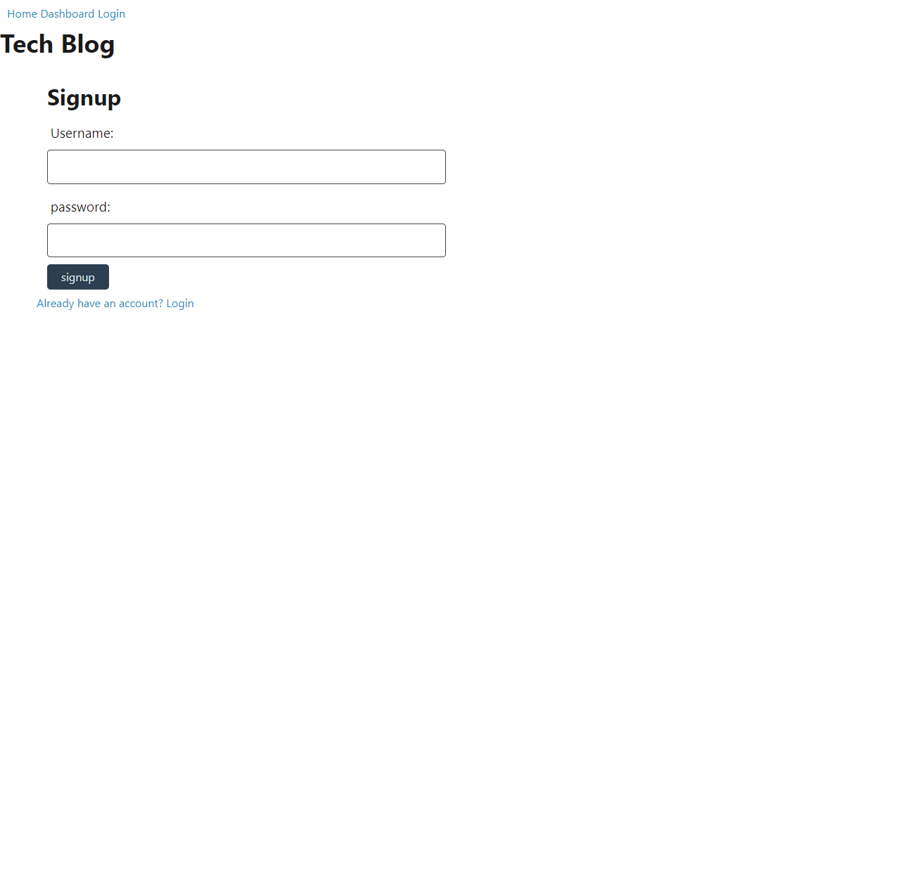

# techBlog

## Description
The goal was to create a deployed tech blog, where users could sign up and post/comment. The data should be stored on a server and the user should have access to edit/delete their posts. Unfortunately, I was unable to get my database, routes, and handlebars to connect properly. On the home page, the seeded posts were able to be loaded in. But on every other page, there was no connection to anything else. I learned a lot working with the express session, but I am still very confused on the sequilize and express handlebars.  

## Table of Contents (Optional)
- [Installation](#installation)
- [Usage](#usage)
- [Credits](#credits)
- [License](#license)

## Installation
express.js, express-session, express-handlebars, dotenv, bcrypt, sequelize, 

## Usage
Here is a link to the deployed Tech Blog. [Tech blog deployed link](https://stump-blog.herokuapp.com/)

When the page is loaded, the homepage will appear as seen below. Currently because my api routes were not connecting properly, the screen is very bland and the dates/time are not being loaded correctly.

The user can click on the displayed posts to take them to that post route. As shown below, none of the posts data is being loaded to this handlebar page. 

Back on the home page, if the user selects to login, they are taken to the login route. This page displays properly and also has the option to go to a signup route as well. However, the button does not function properly and due to lack of connection.

## Credits
1. [MDN](https://developer.mozilla.org/en-US/)
2. [Geshan's blog](https://geshan.com.np/blog/2020/11/nodejs-mysql-tutorial/)
3. [Express-session](https://www.npmjs.com/package/express-session)
4. [sequelize](https://sequelize.org/)
5. [express handlebars](https://www.npmjs.com/package/express-handlebars)

## License
[License](./LICENSE)

## Badges
N/A

## How to Contribute
If anyone could help with this project, it would be greatly appreciated. This is my [GitHub](https://github.com/MaxStump13) account. 

